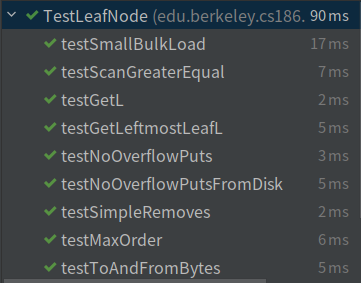

# Task1:LeafNode::fromBytes

实现`LeafNode`的序列化和反序列化。

- 反序列化时对于`rightSibling`必须判断是否为-1，如果为-1必须反序列化为Optional.empty()，否则Task3报错


# Task2:get, getLeftmostLeaf, put, remove

实现`LeafNode` `InnerNode` `BPlusTree`的增删查功能；

- 本实验删除记录不涉及合并节点


## LeafNode

### get

返回this即可；


### getLeftmostLeaf

返回this即可；


### put

1. 判断是否重复put；
2. 调用InnerNode.numLessThanEqual找到put 位置；
3. put；
4. 判断是否超出2d；
5. 如果超出分裂节点，`COPY`分裂后的第二个节点的第一个key返回；


### remove

存在对应key则删除；


## InnerNode

### get

1. 调用numLessThanEqual找到对应子节点；
2. 子节点递归调用get；


### getLeftmostLeaf

1. 取最左子节点；
2. 递归调用getLeftmostLeaf；


### put

1. 找到合适的put子节点；
2. 子节点递归调用put；
3. 如果返回值（即子节点分裂），找到合适的位置插入返回值；
4. 如果插入后超过2d，分裂当前节点，`MOVE`分裂后的第二节点的第一个key返回；


### remove

找到合适的子节点，递归调用remove；


## BPlusTree

### get

root直接调用get；


### put

1. root直接调用put方法；
2. 如果有返回值，即root分裂，记录返回的key与返回的pageId，当前pageId即可；


### remove

root直接调用remove；


# Task3:Scans

主要在BPlusTree的子类BPlusTreeIterator中实现；

定义两个成员变量：

1. LeafNode：以叶子节点为单位加载到内存；
2. currentIterator：叶子节点的Iterator，源代码中LeafNode已经实现获取方法LeafNode::ScanAll；


**hasNext:**

如果currentIterator.hasNext()为true 或者 当前叶子节点右边还有节点返回true；


**Next:**

先从currentIterator获取，获取失败则加载右边的叶子节点获取；


## ScanAll

返回一个包含最左LeafNode的BPlusTreeIterator；


## scanGreaterEqual

先查找到相应大小的LeafNode，再把该节点传入BPlusTreeIterator的构造方法；


# Task 4: Bulk Load

类似于put；


## LeafNode

修改put方法，将容量改为参数给定容量，使用迭代的方式获取数据即可；


## InnerNode

修改put方法，将数据获取方式改为迭代；

- 注意参数中的负载因子只用于LeafNode，与InnerNode无关

    > ```
    > fillFactor should ONLY be used for determining how full leaf nodes are
    > * (not inner nodes)
    > ```


## BPlusTree

修改put方法，加上一个判断data.hasNext()的循环即可；


# 测试结果

通过所有给定测试


**BPlusTree:**


**BPlusNode:**


**InnerNode:**


**LeafNode:**


