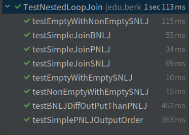
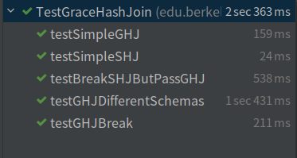
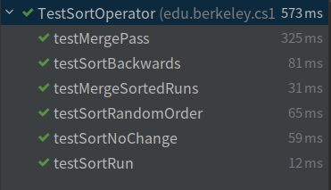
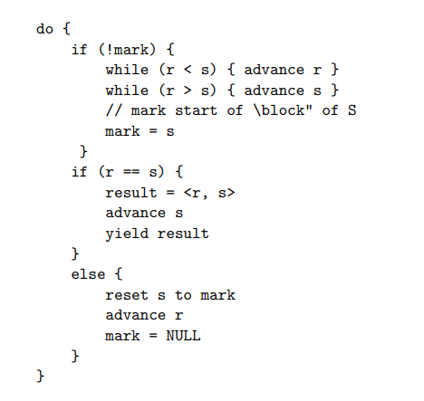

# Task1:Nested Loop Joins

## Block Nested Loop Join(BNLJ)

主要实现方法`edu...query.join.BNLJOperator.BNLJIterator#fetchNextRecord`

该方法返回Join的下一条record，如果没有，返回null

[主要逻辑](https://cs186.gitbook.io/project/assignments/proj3/part-1-join-algorithms#block-nested-loop-join-bnlj)

> The `fetchNextRecord` method should, as its name suggests, fetches the next record of the join output. When implementing this method there are 4 important cases you should consider:
>
> - 
>
>     Case 1: The right page iterator has a value to yield
>
>     （右边的page有值 --> 继续读右边的下一个值）
>
> - 
>
>     Case 2: The right page iterator doesn't have a value to yield but the left block iterator does
>
>     （右边page没有值，但左边仍然可以继续迭代 --> 重设右边，读左边下一个值）
>
> - 
>
>     Case 3: Neither the right page nor left block iterators have values to yield, but there's more right pages
>
>     （左右的page都不能继续迭代，但右边还有page --> 重设左边，读入右边下一个page）
>
> - 
>
>     Case 4: Neither right page nor left block iterators have values nor are there more right pages, but there are still left blocks
>
>     （左右的page都不能继续迭代，但左边还有page --> 读入下一个左边的page，右边重设到第一个page的开始点rightSourceIterator.reset()）

测试通过：

# Task 2: Hash Joins

## Grace Hash Join (GHJ)

You will need to implement the functions `partition`, `buildAndProbe`, and `run`. Additionally, you will have to provide some inputs in `getBreakSHJInputs` and `getBreakGHJInputs` which will be used to test that Simple Hash Join fails but Grace Hash Join passes (tested in `testBreakSHJButPassGHJ`) and that GHJ breaks (tested in `testGHJBreak`) respectively.

### partition

将参数records散列到参数partition[]中，注意根据参数pass选择hash算法即可

### buildAndProbe

将给定的partition匹配并存储

参考给出的SHJOperator的实现，根据参数probeFirst确定concat的顺序

### run

如果左右两个partition都能装入内存，就调用buildAndProbe函数

否则递归调用run

### getBreakSHJInputs

构造一个Simple Hash Join 无法通过，Grace Hash Join可以通过的输入

Buffer Page = 6,每个Page可以存8个record

输入11个Page，其中的record均匀散列

### getBreakGHJInputs

构造一个Grace Hash Join无法处理的输入（本次实验限定最多hash 5次）

输入5个Page，其中每个record都相同

测试通过：

# Task 3: External Sort

外部排序

## sortRun

返回一个排好序的run

将record都存入内存，调用Java内置的排序函数即可

## mergeSortRuns

将多个排好序的run归并

利用Priority Queue的特性完成

## mergePass

给定包含N个run的列表，返回每numsBuffers-1个run归并为一组的列表

设定一个temp列表，每当有numsBuffers-1个run进入temp就调用mergeSortRuns()

测试通过：

## Sort

对source operator进行外部归并排序

调用QueryOperator.getBlockIterator，将source转换为可以放入内存进行排序的大小，最后将全部runs进行归并（如果runs只有一个run，直接返回）

# Task 4: Sort Merge Join

主要实现`edu...query.join.SortMergeOperator.SortMergeIterator#fetchNextRecord`方法

主要思路参考[note8](https://cs186berkeley.net/resources/static/notes/n08-Joins.pdf)

1. 如果left为null，直接返回null
2. 如果left还有值，但right没有值，说明left剩下的值都无法与right匹配，直接返回null